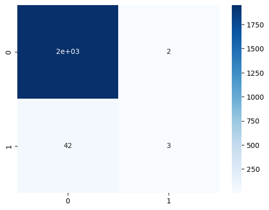
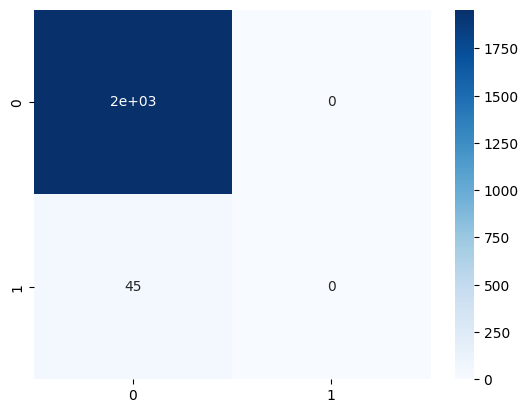
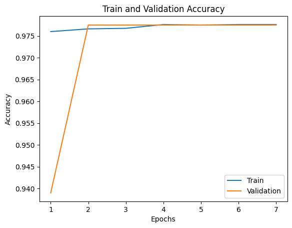
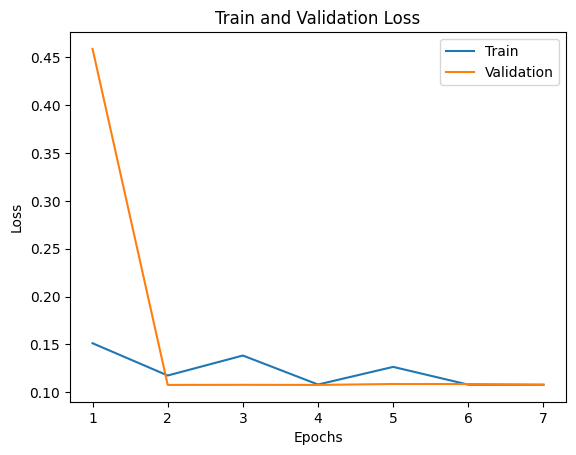

**AIVLE School 미니프로젝트**
### **VOC를 제기한 고객의 <span style="color:darkgreen">해지 여부</span> 예측 문제**
---

#### **<span style="color:red">[미션 안내]</span>**
* VOC를 제기한 고객의 데이터를 읽어들여 데이터를 분석 및 전처리한 후 머신러닝과 딥러닝으로 해지 여부를 예측하고 결과를 분석하세요.

#### **<span style="color:red">[유의 사항]</span>**
* 각 문항의 답안코드는 반드시 '#여기에 답안코드를 작성하세요'로 표시된 cell에 작성해야 합니다.
* 제공된 cell을 추가/삭제하고 다른 cell에 답안코드를 작성 시 채점되지 않습니다.
* 반드시 문제에 제시된 가이드를 읽고 답안 작성하세요.
* 문제에 변수명이 제시된 경우 반드시 해당 변수명을 사용하세요.
* 문제와 데이터는 제3자에게 공유하거나 개인적인 용도로 사용하는 등 외부로 유출할 수 없으며 유출로 인한 책임은 응시자 본인에게 있습니다.


```python
# 코드실행시 경고 메시지 무시
import warnings
warnings.filterwarnings(action='ignore')
```

<br>

## **<span style="color:black">1. 필요한 라이브러리 설치</span>**

<Br>
<font color=blue>1-1. pip 이용해서 seaborn을 설치하세요.</font>


```python
# 여기에 답안코드를 작성하세요.

!pip install seaborn
```

    Requirement already satisfied: seaborn in c:\users\user\anaconda3\lib\site-packages (0.13.2)
    Requirement already satisfied: numpy!=1.24.0,>=1.20 in c:\users\user\anaconda3\lib\site-packages (from seaborn) (1.26.4)
    Requirement already satisfied: pandas>=1.2 in c:\users\user\anaconda3\lib\site-packages (from seaborn) (2.2.3)
    Requirement already satisfied: matplotlib!=3.6.1,>=3.4 in c:\users\user\anaconda3\lib\site-packages (from seaborn) (3.9.2)
    Requirement already satisfied: contourpy>=1.0.1 in c:\users\user\anaconda3\lib\site-packages (from matplotlib!=3.6.1,>=3.4->seaborn) (1.2.0)
    Requirement already satisfied: cycler>=0.10 in c:\users\user\anaconda3\lib\site-packages (from matplotlib!=3.6.1,>=3.4->seaborn) (0.11.0)
    Requirement already satisfied: fonttools>=4.22.0 in c:\users\user\anaconda3\lib\site-packages (from matplotlib!=3.6.1,>=3.4->seaborn) (4.51.0)
    Requirement already satisfied: kiwisolver>=1.3.1 in c:\users\user\anaconda3\lib\site-packages (from matplotlib!=3.6.1,>=3.4->seaborn) (1.4.4)
    Requirement already satisfied: packaging>=20.0 in c:\users\user\anaconda3\lib\site-packages (from matplotlib!=3.6.1,>=3.4->seaborn) (23.2)
    Requirement already satisfied: pillow>=8 in c:\users\user\anaconda3\lib\site-packages (from matplotlib!=3.6.1,>=3.4->seaborn) (10.3.0)
    Requirement already satisfied: pyparsing>=2.3.1 in c:\users\user\anaconda3\lib\site-packages (from matplotlib!=3.6.1,>=3.4->seaborn) (3.0.9)
    Requirement already satisfied: python-dateutil>=2.7 in c:\users\user\anaconda3\lib\site-packages (from matplotlib!=3.6.1,>=3.4->seaborn) (2.9.0.post0)
    Requirement already satisfied: pytz>=2020.1 in c:\users\user\anaconda3\lib\site-packages (from pandas>=1.2->seaborn) (2024.1)
    Requirement already satisfied: tzdata>=2022.7 in c:\users\user\anaconda3\lib\site-packages (from pandas>=1.2->seaborn) (2023.3)
    Requirement already satisfied: six>=1.5 in c:\users\user\anaconda3\lib\site-packages (from python-dateutil>=2.7->matplotlib!=3.6.1,>=3.4->seaborn) (1.16.0)
    

<br>
<font color=blue>1-2. numpy 별칭을 np로, pandas 별칭을 pd로 해서 임포트 하세요</font>


```python
# 여기에 답안코드를 작성하세요.
import numpy as np
import pandas as pd

```

<br>
<font color=blue>1-3. matplotlib 라이브러리를 plt로, seaborn을 sns로 해서 임포트 하세요


```python
# 여기에 답안코드를 작성하세요.
import matplotlib as plt
import seaborn as sns
```

<br>

## **<span style="color:black">2. Tabular 데이터 로딩</span>**

<br>
<font color=blue>2-1. pandas read_csv 함수를 사용하여 voc_data.csv 파일을 읽어온 후 df에 저장하세요.</font>


```python
# 여기에 답안코드를 작성하세요.
df = pd.read_csv('voc_data.csv')
```

<br>

## **<span style="color:black">3. 데이터의 구성 확인</span>**

<br>
<font color=blue>3-1. "df" DataFrame 이용해서 읽어들인 파일의 앞부분 5줄, 뒷부분 5줄을 출력하세요</font>


```python
# 여기에 답안코드를 작성하세요.
df.head(5)

```


<div>
<style scoped>
    .dataframe tbody tr th:only-of-type {
        vertical-align: middle;
    }

    .dataframe tbody tr th {
        vertical-align: top;
    }

    .dataframe thead th {
        text-align: right;
    }
</style>
<table border="1" class="dataframe">
  <thead>
    <tr style="text-align: right;">
      <th></th>
      <th>voc_trt_perd_itg_cd</th>
      <th>voc_prod_sbt_id</th>
      <th>voc_wjt_sorc_id</th>
      <th>voc_type_itg_cd</th>
      <th>voc_sttus_itg_cd</th>
      <th>voc_trt_reslt_itg_cd</th>
      <th>cust_clas_itg_cd</th>
      <th>bprod_sbt_id</th>
      <th>age_itg_cd</th>
      <th>cont_sttus_itg_cd</th>
      <th>...</th>
      <th>voc_dupl_tmscnt</th>
      <th>oos_cause_type_itg_cd</th>
      <th>voc_trt_need_time_itg_cd</th>
      <th>engt_cperd_type_itg_cd</th>
      <th>engt_tgt_div_itg_cd</th>
      <th>cont_fns_pam_date</th>
      <th>voc_mis_pbls_yn</th>
      <th>fclt_oos_yn</th>
      <th>cust_snsry_base_conf_need_time</th>
      <th>trm_yn</th>
    </tr>
  </thead>
  <tbody>
    <tr>
      <th>0</th>
      <td>_</td>
      <td>1000665328</td>
      <td>2153</td>
      <td>10009</td>
      <td>10002</td>
      <td>_</td>
      <td>F</td>
      <td>1000001126</td>
      <td>36</td>
      <td>10001</td>
      <td>...</td>
      <td>0</td>
      <td>_</td>
      <td>10001</td>
      <td>_</td>
      <td>_</td>
      <td>99991231</td>
      <td>N</td>
      <td>_</td>
      <td>0</td>
      <td>N</td>
    </tr>
    <tr>
      <th>1</th>
      <td>_</td>
      <td>1001028714</td>
      <td>3311</td>
      <td>10009</td>
      <td>10002</td>
      <td>10081</td>
      <td>G</td>
      <td>1000852226</td>
      <td>32</td>
      <td>10001</td>
      <td>...</td>
      <td>0</td>
      <td>_</td>
      <td>10001</td>
      <td>15098</td>
      <td>15244</td>
      <td>20220319</td>
      <td>N</td>
      <td>_</td>
      <td>0</td>
      <td>N</td>
    </tr>
    <tr>
      <th>2</th>
      <td>_</td>
      <td>1001028567</td>
      <td>1575</td>
      <td>10009</td>
      <td>10002</td>
      <td>_</td>
      <td>G</td>
      <td>1000851875</td>
      <td>52</td>
      <td>10001</td>
      <td>...</td>
      <td>0</td>
      <td>10268</td>
      <td>10001</td>
      <td>15097</td>
      <td>15244</td>
      <td>20220508</td>
      <td>N</td>
      <td>N</td>
      <td>0</td>
      <td>N</td>
    </tr>
    <tr>
      <th>3</th>
      <td>10000</td>
      <td>1000665328</td>
      <td>3546</td>
      <td>10009</td>
      <td>10002</td>
      <td>_</td>
      <td>_</td>
      <td>1000001126</td>
      <td>_</td>
      <td>10001</td>
      <td>...</td>
      <td>0</td>
      <td>_</td>
      <td>10001</td>
      <td>_</td>
      <td>_</td>
      <td>99991231</td>
      <td>N</td>
      <td>_</td>
      <td>0</td>
      <td>N</td>
    </tr>
    <tr>
      <th>4</th>
      <td>_</td>
      <td>1000779276</td>
      <td>3086</td>
      <td>10009</td>
      <td>10002</td>
      <td>_</td>
      <td>G</td>
      <td>1000764639</td>
      <td>50</td>
      <td>10001</td>
      <td>...</td>
      <td>0</td>
      <td>_</td>
      <td>10001</td>
      <td>_</td>
      <td>_</td>
      <td>99991231</td>
      <td>N</td>
      <td>_</td>
      <td>0</td>
      <td>N</td>
    </tr>
  </tbody>
</table>
<p>5 rows × 24 columns</p>
</div>


```python
# 여기에 답안코드를 작성하세요.
df.tail(5)

```


<div>
<style scoped>
    .dataframe tbody tr th:only-of-type {
        vertical-align: middle;
    }

    .dataframe tbody tr th {
        vertical-align: top;
    }

    .dataframe thead th {
        text-align: right;
    }
</style>
<table border="1" class="dataframe">
  <thead>
    <tr style="text-align: right;">
      <th></th>
      <th>voc_trt_perd_itg_cd</th>
      <th>voc_prod_sbt_id</th>
      <th>voc_wjt_sorc_id</th>
      <th>voc_type_itg_cd</th>
      <th>voc_sttus_itg_cd</th>
      <th>voc_trt_reslt_itg_cd</th>
      <th>cust_clas_itg_cd</th>
      <th>bprod_sbt_id</th>
      <th>age_itg_cd</th>
      <th>cont_sttus_itg_cd</th>
      <th>...</th>
      <th>voc_dupl_tmscnt</th>
      <th>oos_cause_type_itg_cd</th>
      <th>voc_trt_need_time_itg_cd</th>
      <th>engt_cperd_type_itg_cd</th>
      <th>engt_tgt_div_itg_cd</th>
      <th>cont_fns_pam_date</th>
      <th>voc_mis_pbls_yn</th>
      <th>fclt_oos_yn</th>
      <th>cust_snsry_base_conf_need_time</th>
      <th>trm_yn</th>
    </tr>
  </thead>
  <tbody>
    <tr>
      <th>9995</th>
      <td>_</td>
      <td>1000811136</td>
      <td>2123</td>
      <td>10009</td>
      <td>10002</td>
      <td>_</td>
      <td>G</td>
      <td>1000809259</td>
      <td>17</td>
      <td>10001</td>
      <td>...</td>
      <td>0</td>
      <td>_</td>
      <td>10001</td>
      <td>_</td>
      <td>_</td>
      <td>99991231</td>
      <td>N</td>
      <td>_</td>
      <td>0</td>
      <td>N</td>
    </tr>
    <tr>
      <th>9996</th>
      <td>_</td>
      <td>1001047799</td>
      <td>2153</td>
      <td>10009</td>
      <td>10002</td>
      <td>_</td>
      <td>I</td>
      <td>1001046521</td>
      <td>35</td>
      <td>10001</td>
      <td>...</td>
      <td>0</td>
      <td>_</td>
      <td>10001</td>
      <td>_</td>
      <td>_</td>
      <td>99991231</td>
      <td>N</td>
      <td>_</td>
      <td>0</td>
      <td>N</td>
    </tr>
    <tr>
      <th>9997</th>
      <td>_</td>
      <td>1001027819</td>
      <td>379</td>
      <td>10009</td>
      <td>10002</td>
      <td>_</td>
      <td>G</td>
      <td>1000720809</td>
      <td>51</td>
      <td>10001</td>
      <td>...</td>
      <td>0</td>
      <td>10270</td>
      <td>10001</td>
      <td>15097</td>
      <td>15244</td>
      <td>20180903</td>
      <td>N</td>
      <td>N</td>
      <td>0</td>
      <td>N</td>
    </tr>
    <tr>
      <th>9998</th>
      <td>_</td>
      <td>1001027819</td>
      <td>314</td>
      <td>10009</td>
      <td>10002</td>
      <td>_</td>
      <td>I</td>
      <td>1000720809</td>
      <td>_</td>
      <td>10001</td>
      <td>...</td>
      <td>0</td>
      <td>_</td>
      <td>10001</td>
      <td>15097</td>
      <td>15244</td>
      <td>20210412</td>
      <td>N</td>
      <td>_</td>
      <td>0</td>
      <td>N</td>
    </tr>
    <tr>
      <th>9999</th>
      <td>_</td>
      <td>1001047802</td>
      <td>2266</td>
      <td>10009</td>
      <td>10002</td>
      <td>_</td>
      <td>G</td>
      <td>1001046524</td>
      <td>27</td>
      <td>10001</td>
      <td>...</td>
      <td>0</td>
      <td>_</td>
      <td>10001</td>
      <td>_</td>
      <td>_</td>
      <td>99991231</td>
      <td>N</td>
      <td>_</td>
      <td>0</td>
      <td>N</td>
    </tr>
  </tbody>
</table>
<p>5 rows × 24 columns</p>
</div>


<br>
<font color=blue>3-2. 데이터프레임 정보(컬럼정보, Null 여부, 타입) 출력하세요</font>


```python
# 여기에 답안코드를 작성하세요.
df.info()

```

    <class 'pandas.core.frame.DataFrame'>
    RangeIndex: 10000 entries, 0 to 9999
    Data columns (total 24 columns):
     #   Column                          Non-Null Count  Dtype 
    ---  ------                          --------------  ----- 
     0   voc_trt_perd_itg_cd             10000 non-null  object
     1   voc_prod_sbt_id                 10000 non-null  int64 
     2   voc_wjt_sorc_id                 10000 non-null  int64 
     3   voc_type_itg_cd                 10000 non-null  int64 
     4   voc_sttus_itg_cd                10000 non-null  int64 
     5   voc_trt_reslt_itg_cd            10000 non-null  object
     6   cust_clas_itg_cd                10000 non-null  object
     7   bprod_sbt_id                    10000 non-null  int64 
     8   age_itg_cd                      10000 non-null  object
     9   cont_sttus_itg_cd               10000 non-null  object
     10  new_date                        10000 non-null  int64 
     11  opn_nfl_chg_date                10000 non-null  int64 
     12  cust_dtl_ctg_itg_cd             10000 non-null  object
     13  voc_trt_degr_div_itg_cd         10000 non-null  int64 
     14  voc_dupl_tmscnt                 10000 non-null  int64 
     15  oos_cause_type_itg_cd           10000 non-null  object
     16  voc_trt_need_time_itg_cd        10000 non-null  int64 
     17  engt_cperd_type_itg_cd          10000 non-null  object
     18  engt_tgt_div_itg_cd             10000 non-null  object
     19  cont_fns_pam_date               10000 non-null  int64 
     20  voc_mis_pbls_yn                 10000 non-null  object
     21  fclt_oos_yn                     10000 non-null  object
     22  cust_snsry_base_conf_need_time  10000 non-null  int64 
     23  trm_yn                          10000 non-null  object
    dtypes: int64(12), object(12)
    memory usage: 1.8+ MB
    

<br>
<font color=blue>3-3. 데이터프레임 인덱스를 확인하세요</font>


```python
# 여기에 답안코드를 작성하세요.
df.index
```


    RangeIndex(start=0, stop=10000, step=1)


<br>
<font color=blue>3-4. 데이터프레임 컬럼을 확인하세요</font>


```python
# 여기에 답안코드를 작성하세요.
df.columns

```


    Index(['voc_trt_perd_itg_cd', 'voc_prod_sbt_id', 'voc_wjt_sorc_id',
           'voc_type_itg_cd', 'voc_sttus_itg_cd', 'voc_trt_reslt_itg_cd',
           'cust_clas_itg_cd', 'bprod_sbt_id', 'age_itg_cd', 'cont_sttus_itg_cd',
           'new_date', 'opn_nfl_chg_date', 'cust_dtl_ctg_itg_cd',
           'voc_trt_degr_div_itg_cd', 'voc_dupl_tmscnt', 'oos_cause_type_itg_cd',
           'voc_trt_need_time_itg_cd', 'engt_cperd_type_itg_cd',
           'engt_tgt_div_itg_cd', 'cont_fns_pam_date', 'voc_mis_pbls_yn',
           'fclt_oos_yn', 'cust_snsry_base_conf_need_time', 'trm_yn'],
          dtype='object')


<br>
<font color=blue>3-5. 데이터프레임 값(value)을 확인하세요</font>


```python
# 여기에 답안코드를 작성하세요.
df.values

```


    array([['_', 1000665328, 2153, ..., '_', 0, 'N'],
           ['_', 1001028714, 3311, ..., '_', 0, 'N'],
           ['_', 1001028567, 1575, ..., 'N', 0, 'N'],
           ...,
           ['_', 1001027819, 379, ..., 'N', 0, 'N'],
           ['_', 1001027819, 314, ..., '_', 0, 'N'],
           ['_', 1001047802, 2266, ..., '_', 0, 'N']], dtype=object)


<br>
<font color=blue>3-6. 데이터프레임의 계산 가능한 값들에 대한 통계치를 확인하세요</font>


```python
# 여기에 답안코드를 작성하세요.
df.describe() # 땡 틀렸음 >> Describe 

```


<div>
<style scoped>
    .dataframe tbody tr th:only-of-type {
        vertical-align: middle;
    }

    .dataframe tbody tr th {
        vertical-align: top;
    }

    .dataframe thead th {
        text-align: right;
    }
</style>
<table border="1" class="dataframe">
  <thead>
    <tr style="text-align: right;">
      <th></th>
      <th>voc_prod_sbt_id</th>
      <th>voc_wjt_sorc_id</th>
      <th>voc_type_itg_cd</th>
      <th>voc_sttus_itg_cd</th>
      <th>bprod_sbt_id</th>
      <th>new_date</th>
      <th>opn_nfl_chg_date</th>
      <th>voc_trt_degr_div_itg_cd</th>
      <th>voc_dupl_tmscnt</th>
      <th>voc_trt_need_time_itg_cd</th>
      <th>cont_fns_pam_date</th>
      <th>cust_snsry_base_conf_need_time</th>
    </tr>
  </thead>
  <tbody>
    <tr>
      <th>count</th>
      <td>1.000000e+04</td>
      <td>10000.00000</td>
      <td>10000.00000</td>
      <td>10000.000000</td>
      <td>1.000000e+04</td>
      <td>1.000000e+04</td>
      <td>1.000000e+04</td>
      <td>10000.000000</td>
      <td>10000.000000</td>
      <td>10000.000000</td>
      <td>1.000000e+04</td>
      <td>10000.00000</td>
    </tr>
    <tr>
      <th>mean</th>
      <td>9.907267e+08</td>
      <td>1578.29170</td>
      <td>10008.52360</td>
      <td>10002.043400</td>
      <td>8.838173e+08</td>
      <td>1.744283e+07</td>
      <td>1.744505e+07</td>
      <td>20001.074200</td>
      <td>0.008800</td>
      <td>10002.656800</td>
      <td>7.004469e+07</td>
      <td>193.88010</td>
    </tr>
    <tr>
      <th>std</th>
      <td>1.005780e+08</td>
      <td>1078.63717</td>
      <td>1.57927</td>
      <td>0.314843</td>
      <td>3.214229e+08</td>
      <td>6.849207e+06</td>
      <td>6.850077e+06</td>
      <td>0.262109</td>
      <td>0.103555</td>
      <td>6.576864</td>
      <td>3.863802e+07</td>
      <td>6970.03853</td>
    </tr>
    <tr>
      <th>min</th>
      <td>-9.980000e+02</td>
      <td>126.00000</td>
      <td>10003.00000</td>
      <td>10002.000000</td>
      <td>-9.980000e+02</td>
      <td>1.010100e+04</td>
      <td>1.010100e+04</td>
      <td>20001.000000</td>
      <td>0.000000</td>
      <td>10001.000000</td>
      <td>2.001063e+07</td>
      <td>0.00000</td>
    </tr>
    <tr>
      <th>25%</th>
      <td>1.000782e+09</td>
      <td>360.00000</td>
      <td>10009.00000</td>
      <td>10002.000000</td>
      <td>1.000003e+09</td>
      <td>2.008053e+07</td>
      <td>2.008123e+07</td>
      <td>20001.000000</td>
      <td>0.000000</td>
      <td>10001.000000</td>
      <td>2.021102e+07</td>
      <td>0.00000</td>
    </tr>
    <tr>
      <th>50%</th>
      <td>1.001028e+09</td>
      <td>2056.00000</td>
      <td>10009.00000</td>
      <td>10002.000000</td>
      <td>1.000749e+09</td>
      <td>2.014121e+07</td>
      <td>2.015031e+07</td>
      <td>20001.000000</td>
      <td>0.000000</td>
      <td>10001.000000</td>
      <td>9.999123e+07</td>
      <td>0.00000</td>
    </tr>
    <tr>
      <th>75%</th>
      <td>1.001036e+09</td>
      <td>2153.00000</td>
      <td>10009.00000</td>
      <td>10002.000000</td>
      <td>1.001044e+09</td>
      <td>2.018010e+07</td>
      <td>2.018032e+07</td>
      <td>20001.000000</td>
      <td>0.000000</td>
      <td>10001.000000</td>
      <td>9.999123e+07</td>
      <td>0.00000</td>
    </tr>
    <tr>
      <th>max</th>
      <td>1.001079e+09</td>
      <td>3856.00000</td>
      <td>10017.00000</td>
      <td>10005.000000</td>
      <td>1.001078e+09</td>
      <td>2.020041e+07</td>
      <td>2.020041e+07</td>
      <td>20002.000000</td>
      <td>3.000000</td>
      <td>10038.000000</td>
      <td>9.999123e+07</td>
      <td>367991.00000</td>
    </tr>
  </tbody>
</table>
</div>


<br>
<font color=blue>3-7. DataFrame 컬럼 항목에 Null 존재하는지 확인하세요.  (null값의 합계 포함)</font>


```python
# 여기에 답안코드를 작성하세요.
df.isna().sum()

```


    voc_trt_perd_itg_cd               0
    voc_prod_sbt_id                   0
    voc_wjt_sorc_id                   0
    voc_type_itg_cd                   0
    voc_sttus_itg_cd                  0
    voc_trt_reslt_itg_cd              0
    cust_clas_itg_cd                  0
    bprod_sbt_id                      0
    age_itg_cd                        0
    cont_sttus_itg_cd                 0
    new_date                          0
    opn_nfl_chg_date                  0
    cust_dtl_ctg_itg_cd               0
    voc_trt_degr_div_itg_cd           0
    voc_dupl_tmscnt                   0
    oos_cause_type_itg_cd             0
    voc_trt_need_time_itg_cd          0
    engt_cperd_type_itg_cd            0
    engt_tgt_div_itg_cd               0
    cont_fns_pam_date                 0
    voc_mis_pbls_yn                   0
    fclt_oos_yn                       0
    cust_snsry_base_conf_need_time    0
    trm_yn                            0
    dtype: int64


<br>
<font color=blue>3-8. voc_trt_perd_itg_cd 컬럼의 데이터를 확인하세요</font>


```python
# 여기에 답안코드를 작성하세요.
df['voc_trt_perd_itg_cd'].values

```


    array(['_', '_', '_', ..., '_', '_', '_'], dtype=object)


<br>
<font color=blue>3-9. voc_trt_perd_itg_cd 컬럼 데이터별 건수를 나열하세요</font>


```python
# 여기에 답안코드를 작성하세요.

df['voc_trt_perd_itg_cd'].value_counts()
```


    voc_trt_perd_itg_cd
    _        5422
    10000    4283
    10001     163
    10002      58
    10003      25
    10004      16
    10005      10
    10006       6
    10008       3
    10009       3
    10016       2
    10011       2
    10012       2
    10007       2
    10014       1
    10013       1
    10015       1
    Name: count, dtype: int64


### 컬럼에서  '_' 값이 차지하는 비율
- voc_trt_perd_itg_cd : 0.54
- voc_trt_reslt_itg_cd : 0.88
- oos_cause_type_itg_cd : 0.9
- engt_cperd_type_itg_cd : 0.63
- engt_tgt_div_itg_cd : 0.63
- fclt_oos_yn : 0.90  
- cust_clas_itg_cd : 0.2
- age_itg_cd : 0.22
- cont_sttus_itg_cd : 0.11
- cust_dtl_ctg_itg_cd : 0.11
- voc_mis_pbls_yn : 0.008


## **<span style="color:black">4. 데이터 결측치 처리</span>**

<br>
<font color=blue>4-1. voc_trt_perd_itg_cd 컬럼에서 '_' 값이 차지하는 비율이 50%가 넘는 것을 확인하고, 이 voc_trt_perd_itg_cd 컬럼을 삭제하세요. (컬럼이 삭제된 데이터를 df1에 저장하세요)</font>


```python
df
```


<div>
<style scoped>
    .dataframe tbody tr th:only-of-type {
        vertical-align: middle;
    }

    .dataframe tbody tr th {
        vertical-align: top;
    }

    .dataframe thead th {
        text-align: right;
    }
</style>
<table border="1" class="dataframe">
  <thead>
    <tr style="text-align: right;">
      <th></th>
      <th>voc_trt_perd_itg_cd</th>
      <th>voc_prod_sbt_id</th>
      <th>voc_wjt_sorc_id</th>
      <th>voc_type_itg_cd</th>
      <th>voc_sttus_itg_cd</th>
      <th>voc_trt_reslt_itg_cd</th>
      <th>cust_clas_itg_cd</th>
      <th>bprod_sbt_id</th>
      <th>age_itg_cd</th>
      <th>cont_sttus_itg_cd</th>
      <th>...</th>
      <th>voc_dupl_tmscnt</th>
      <th>oos_cause_type_itg_cd</th>
      <th>voc_trt_need_time_itg_cd</th>
      <th>engt_cperd_type_itg_cd</th>
      <th>engt_tgt_div_itg_cd</th>
      <th>cont_fns_pam_date</th>
      <th>voc_mis_pbls_yn</th>
      <th>fclt_oos_yn</th>
      <th>cust_snsry_base_conf_need_time</th>
      <th>trm_yn</th>
    </tr>
  </thead>
  <tbody>
    <tr>
      <th>0</th>
      <td>_</td>
      <td>1000665328</td>
      <td>2153</td>
      <td>10009</td>
      <td>10002</td>
      <td>_</td>
      <td>F</td>
      <td>1000001126</td>
      <td>36</td>
      <td>10001</td>
      <td>...</td>
      <td>0</td>
      <td>_</td>
      <td>10001</td>
      <td>_</td>
      <td>_</td>
      <td>99991231</td>
      <td>N</td>
      <td>_</td>
      <td>0</td>
      <td>N</td>
    </tr>
    <tr>
      <th>1</th>
      <td>_</td>
      <td>1001028714</td>
      <td>3311</td>
      <td>10009</td>
      <td>10002</td>
      <td>10081</td>
      <td>G</td>
      <td>1000852226</td>
      <td>32</td>
      <td>10001</td>
      <td>...</td>
      <td>0</td>
      <td>_</td>
      <td>10001</td>
      <td>15098</td>
      <td>15244</td>
      <td>20220319</td>
      <td>N</td>
      <td>_</td>
      <td>0</td>
      <td>N</td>
    </tr>
    <tr>
      <th>2</th>
      <td>_</td>
      <td>1001028567</td>
      <td>1575</td>
      <td>10009</td>
      <td>10002</td>
      <td>_</td>
      <td>G</td>
      <td>1000851875</td>
      <td>52</td>
      <td>10001</td>
      <td>...</td>
      <td>0</td>
      <td>10268</td>
      <td>10001</td>
      <td>15097</td>
      <td>15244</td>
      <td>20220508</td>
      <td>N</td>
      <td>N</td>
      <td>0</td>
      <td>N</td>
    </tr>
    <tr>
      <th>3</th>
      <td>10000</td>
      <td>1000665328</td>
      <td>3546</td>
      <td>10009</td>
      <td>10002</td>
      <td>_</td>
      <td>_</td>
      <td>1000001126</td>
      <td>_</td>
      <td>10001</td>
      <td>...</td>
      <td>0</td>
      <td>_</td>
      <td>10001</td>
      <td>_</td>
      <td>_</td>
      <td>99991231</td>
      <td>N</td>
      <td>_</td>
      <td>0</td>
      <td>N</td>
    </tr>
    <tr>
      <th>4</th>
      <td>_</td>
      <td>1000779276</td>
      <td>3086</td>
      <td>10009</td>
      <td>10002</td>
      <td>_</td>
      <td>G</td>
      <td>1000764639</td>
      <td>50</td>
      <td>10001</td>
      <td>...</td>
      <td>0</td>
      <td>_</td>
      <td>10001</td>
      <td>_</td>
      <td>_</td>
      <td>99991231</td>
      <td>N</td>
      <td>_</td>
      <td>0</td>
      <td>N</td>
    </tr>
    <tr>
      <th>...</th>
      <td>...</td>
      <td>...</td>
      <td>...</td>
      <td>...</td>
      <td>...</td>
      <td>...</td>
      <td>...</td>
      <td>...</td>
      <td>...</td>
      <td>...</td>
      <td>...</td>
      <td>...</td>
      <td>...</td>
      <td>...</td>
      <td>...</td>
      <td>...</td>
      <td>...</td>
      <td>...</td>
      <td>...</td>
      <td>...</td>
      <td>...</td>
    </tr>
    <tr>
      <th>9995</th>
      <td>_</td>
      <td>1000811136</td>
      <td>2123</td>
      <td>10009</td>
      <td>10002</td>
      <td>_</td>
      <td>G</td>
      <td>1000809259</td>
      <td>17</td>
      <td>10001</td>
      <td>...</td>
      <td>0</td>
      <td>_</td>
      <td>10001</td>
      <td>_</td>
      <td>_</td>
      <td>99991231</td>
      <td>N</td>
      <td>_</td>
      <td>0</td>
      <td>N</td>
    </tr>
    <tr>
      <th>9996</th>
      <td>_</td>
      <td>1001047799</td>
      <td>2153</td>
      <td>10009</td>
      <td>10002</td>
      <td>_</td>
      <td>I</td>
      <td>1001046521</td>
      <td>35</td>
      <td>10001</td>
      <td>...</td>
      <td>0</td>
      <td>_</td>
      <td>10001</td>
      <td>_</td>
      <td>_</td>
      <td>99991231</td>
      <td>N</td>
      <td>_</td>
      <td>0</td>
      <td>N</td>
    </tr>
    <tr>
      <th>9997</th>
      <td>_</td>
      <td>1001027819</td>
      <td>379</td>
      <td>10009</td>
      <td>10002</td>
      <td>_</td>
      <td>G</td>
      <td>1000720809</td>
      <td>51</td>
      <td>10001</td>
      <td>...</td>
      <td>0</td>
      <td>10270</td>
      <td>10001</td>
      <td>15097</td>
      <td>15244</td>
      <td>20180903</td>
      <td>N</td>
      <td>N</td>
      <td>0</td>
      <td>N</td>
    </tr>
    <tr>
      <th>9998</th>
      <td>_</td>
      <td>1001027819</td>
      <td>314</td>
      <td>10009</td>
      <td>10002</td>
      <td>_</td>
      <td>I</td>
      <td>1000720809</td>
      <td>_</td>
      <td>10001</td>
      <td>...</td>
      <td>0</td>
      <td>_</td>
      <td>10001</td>
      <td>15097</td>
      <td>15244</td>
      <td>20210412</td>
      <td>N</td>
      <td>_</td>
      <td>0</td>
      <td>N</td>
    </tr>
    <tr>
      <th>9999</th>
      <td>_</td>
      <td>1001047802</td>
      <td>2266</td>
      <td>10009</td>
      <td>10002</td>
      <td>_</td>
      <td>G</td>
      <td>1001046524</td>
      <td>27</td>
      <td>10001</td>
      <td>...</td>
      <td>0</td>
      <td>_</td>
      <td>10001</td>
      <td>_</td>
      <td>_</td>
      <td>99991231</td>
      <td>N</td>
      <td>_</td>
      <td>0</td>
      <td>N</td>
    </tr>
  </tbody>
</table>
<p>10000 rows × 24 columns</p>
</div>


```python
# 여기에 답안코드를 작성하세요.
drop_cols = ['voc_trt_perd_itg_cd']
df1 = df.drop(columns = drop_cols)
```

<br>
<font color=blue>4-2. 'df1' DataFrame에서 '_' 값이 50% 이상되는 나머지 컬럼도 삭제하세요</font>


```python
# 여기에 답안코드를 작성하세요.
drop_cols = ['voc_trt_reslt_itg_cd',
             'oos_cause_type_itg_cd',
             'engt_cperd_type_itg_cd',
             'engt_tgt_div_itg_cd',
             'fclt_oos_yn']
df1 = df1.drop(columns = drop_cols)
```

<br>
<font color=blue>4-3. 'df1' DataFrame의 'cust_clas_itg_cd' 컬럼에 '_' 값이 몇 개 있는지 확인하여 출력하세요 </font>


```python
# 여기에 답안코드를 작성하세요. 
# 틀림 
# df1['cust_clas_itg_cd'].value_counts()
df1['cust_clas_itg_cd'].value_counts().get('_')
```


    1934


<br>
<font color=blue>4-4. df1의 남아있는 '_'값을 null로 변경: DataFrame replace 함수를 사용해서 모든 컬럼에 대해 '_'값을 null로 변경하고 df2에 저장하세요.</font>


```python
# 여기에 답안코드를 작성하세요.
# (오답) null = >  np.nan
df2 = df1.replace('_',np.nan)
```

<br>
<font color=blue>4-5. df2의 컬럼별 Null 갯수를 확인해보세요.</font>


```python
# 여기에 답안코드를 작성하세요.
df2.isna().sum()

```


    voc_prod_sbt_id                      0
    voc_wjt_sorc_id                      0
    voc_type_itg_cd                      0
    voc_sttus_itg_cd                     0
    cust_clas_itg_cd                  1934
    bprod_sbt_id                         0
    age_itg_cd                        2129
    cont_sttus_itg_cd                 1168
    new_date                             0
    opn_nfl_chg_date                     0
    cust_dtl_ctg_itg_cd               1168
    voc_trt_degr_div_itg_cd              0
    voc_dupl_tmscnt                      0
    voc_trt_need_time_itg_cd             0
    cont_fns_pam_date                    0
    voc_mis_pbls_yn                     86
    cust_snsry_base_conf_need_time       0
    trm_yn                               0
    dtype: int64


<br>
<font color=blue>4-6. df2 데이터프레임 컬럼들의 데이터타입을 확인하세요.</font>


```python
# 여기에 답안코드를 작성하세요.
df2.dtypes

```


    voc_prod_sbt_id                    int64
    voc_wjt_sorc_id                    int64
    voc_type_itg_cd                    int64
    voc_sttus_itg_cd                   int64
    cust_clas_itg_cd                  object
    bprod_sbt_id                       int64
    age_itg_cd                        object
    cont_sttus_itg_cd                 object
    new_date                           int64
    opn_nfl_chg_date                   int64
    cust_dtl_ctg_itg_cd               object
    voc_trt_degr_div_itg_cd            int64
    voc_dupl_tmscnt                    int64
    voc_trt_need_time_itg_cd           int64
    cont_fns_pam_date                  int64
    voc_mis_pbls_yn                   object
    cust_snsry_base_conf_need_time     int64
    trm_yn                            object
    dtype: object


<br>
<font color=blue>4-7. df2 데이터프레임에 대해 먼저, 'cust_clas_itg_cd' 컬럼의 최빈값을 확인하는 코드로 확인하고 다음으로, 이 컬럼의 Null 값을 최빈값으로 변경하세요(fillna 함수 사용). 처리된 데이터프레임은 df3에 저장하세요</font>


```python
# 여기에 답안코드를 작성하세요.
print(df2['cust_clas_itg_cd'].value_counts())# .idxmax()[0] # 최빈값이 뭔지 확인 

df2['cust_clas_itg_cd'] = df2['cust_clas_itg_cd'].fillna('L')

df3 = df2.copy()
```

    cust_clas_itg_cd
    L    2769
    G    1777
    I    1266
    J    1071
    F     903
    O     275
    H       4
    M       1
    Name: count, dtype: int64
    


```python
df3['cust_clas_itg_cd'].value_counts()
```


    cust_clas_itg_cd
    L    4703
    G    1777
    I    1266
    J    1071
    F     903
    O     275
    H       4
    M       1
    Name: count, dtype: int64


<br>
<font color=blue>4-8. df3에 대해 'age_itg_cd'의 null 값을 중앙값(median)으로 변경하고 데이터 타입을 정수(int)로 변경하세요. 데이터 처리 후 데이터프레임을 df4에 저장하세요.</font>


```python
# 여기에 답안코드를 작성하세요.
# (땡)

# 문자열을 숫자형으로 변환 (errors='coerce'로 변환할 수 없는 값은 NaN으로 처리)
df3['age_itg_cd'] = pd.to_numeric(df3['age_itg_cd'], errors='coerce')

median_age = df3['age_itg_cd'].median(skipna=True) # nan 은 계산에서 제외 
df3['age_itg_cd'] = df3['age_itg_cd'].fillna(median_age).astype(int)

# 처리된 데이터프레임을 df4에 저장
df4 = df3.copy()
```

<br>
<font color=blue>4-9. df4에 대해 'cont_sttus_itg_cd'의 null 값을 최빈값(mode)으로 변경하세요. 데이터 처리 후 데이터프레임을 df5에 저장하세요.</font>


```python
# 여기에 답안코드를 작성하세요.
most=df4['cont_sttus_itg_cd'].mode()[0]
# most 최빈값
df4['cont_sttus_itg_cd'] = df['cont_sttus_itg_cd'].fillna(most)

df5 = df4.copy()


```

<br>
<font color=blue>4-10. df5에 대해 'cust_dtl_ctg_itg_cd'의 null 값을 최빈값(mode)으로 변경하세요</font>


```python
# 여기에 답안코드를 작성하세요.
most2 = df5['cust_dtl_ctg_itg_cd'].mode()[0]

df5['cust_dtl_ctg_itg_cd'] = df5['cust_dtl_ctg_itg_cd'].fillna(most2)

```


```python
df5
```


<div>
<style scoped>
    .dataframe tbody tr th:only-of-type {
        vertical-align: middle;
    }

    .dataframe tbody tr th {
        vertical-align: top;
    }

    .dataframe thead th {
        text-align: right;
    }
</style>
<table border="1" class="dataframe">
  <thead>
    <tr style="text-align: right;">
      <th></th>
      <th>voc_prod_sbt_id</th>
      <th>voc_wjt_sorc_id</th>
      <th>voc_type_itg_cd</th>
      <th>voc_sttus_itg_cd</th>
      <th>cust_clas_itg_cd</th>
      <th>bprod_sbt_id</th>
      <th>age_itg_cd</th>
      <th>cont_sttus_itg_cd</th>
      <th>new_date</th>
      <th>opn_nfl_chg_date</th>
      <th>cust_dtl_ctg_itg_cd</th>
      <th>voc_trt_degr_div_itg_cd</th>
      <th>voc_dupl_tmscnt</th>
      <th>voc_trt_need_time_itg_cd</th>
      <th>cont_fns_pam_date</th>
      <th>voc_mis_pbls_yn</th>
      <th>cust_snsry_base_conf_need_time</th>
      <th>trm_yn</th>
    </tr>
  </thead>
  <tbody>
    <tr>
      <th>0</th>
      <td>1000665328</td>
      <td>2153</td>
      <td>10009</td>
      <td>10002</td>
      <td>F</td>
      <td>1000001126</td>
      <td>36</td>
      <td>10001</td>
      <td>19881005</td>
      <td>19881005</td>
      <td>10003</td>
      <td>20001</td>
      <td>0</td>
      <td>10001</td>
      <td>99991231</td>
      <td>N</td>
      <td>0</td>
      <td>N</td>
    </tr>
    <tr>
      <th>1</th>
      <td>1001028714</td>
      <td>3311</td>
      <td>10009</td>
      <td>10002</td>
      <td>G</td>
      <td>1000852226</td>
      <td>32</td>
      <td>10001</td>
      <td>20130817</td>
      <td>20130817</td>
      <td>10002</td>
      <td>20001</td>
      <td>0</td>
      <td>10001</td>
      <td>20220319</td>
      <td>N</td>
      <td>0</td>
      <td>N</td>
    </tr>
    <tr>
      <th>2</th>
      <td>1001028567</td>
      <td>1575</td>
      <td>10009</td>
      <td>10002</td>
      <td>G</td>
      <td>1000851875</td>
      <td>52</td>
      <td>10001</td>
      <td>20190509</td>
      <td>20190509</td>
      <td>10003</td>
      <td>20001</td>
      <td>0</td>
      <td>10001</td>
      <td>20220508</td>
      <td>N</td>
      <td>0</td>
      <td>N</td>
    </tr>
    <tr>
      <th>3</th>
      <td>1000665328</td>
      <td>3546</td>
      <td>10009</td>
      <td>10002</td>
      <td>L</td>
      <td>1000001126</td>
      <td>49</td>
      <td>10001</td>
      <td>20190731</td>
      <td>20190731</td>
      <td>90024</td>
      <td>20001</td>
      <td>0</td>
      <td>10001</td>
      <td>99991231</td>
      <td>N</td>
      <td>0</td>
      <td>N</td>
    </tr>
    <tr>
      <th>4</th>
      <td>1000779276</td>
      <td>3086</td>
      <td>10009</td>
      <td>10002</td>
      <td>G</td>
      <td>1000764639</td>
      <td>50</td>
      <td>10001</td>
      <td>20180403</td>
      <td>20180403</td>
      <td>90024</td>
      <td>20001</td>
      <td>0</td>
      <td>10001</td>
      <td>99991231</td>
      <td>N</td>
      <td>0</td>
      <td>N</td>
    </tr>
    <tr>
      <th>...</th>
      <td>...</td>
      <td>...</td>
      <td>...</td>
      <td>...</td>
      <td>...</td>
      <td>...</td>
      <td>...</td>
      <td>...</td>
      <td>...</td>
      <td>...</td>
      <td>...</td>
      <td>...</td>
      <td>...</td>
      <td>...</td>
      <td>...</td>
      <td>...</td>
      <td>...</td>
      <td>...</td>
    </tr>
    <tr>
      <th>9995</th>
      <td>1000811136</td>
      <td>2123</td>
      <td>10009</td>
      <td>10002</td>
      <td>G</td>
      <td>1000809259</td>
      <td>17</td>
      <td>10001</td>
      <td>20180313</td>
      <td>20180313</td>
      <td>10003</td>
      <td>20001</td>
      <td>0</td>
      <td>10001</td>
      <td>99991231</td>
      <td>N</td>
      <td>0</td>
      <td>N</td>
    </tr>
    <tr>
      <th>9996</th>
      <td>1001047799</td>
      <td>2153</td>
      <td>10009</td>
      <td>10002</td>
      <td>I</td>
      <td>1001046521</td>
      <td>35</td>
      <td>10001</td>
      <td>20141208</td>
      <td>20181130</td>
      <td>10003</td>
      <td>20001</td>
      <td>0</td>
      <td>10001</td>
      <td>99991231</td>
      <td>N</td>
      <td>0</td>
      <td>N</td>
    </tr>
    <tr>
      <th>9997</th>
      <td>1001027819</td>
      <td>379</td>
      <td>10009</td>
      <td>10002</td>
      <td>G</td>
      <td>1000720809</td>
      <td>51</td>
      <td>10001</td>
      <td>20150904</td>
      <td>20150904</td>
      <td>90029</td>
      <td>20001</td>
      <td>0</td>
      <td>10001</td>
      <td>20180903</td>
      <td>N</td>
      <td>0</td>
      <td>N</td>
    </tr>
    <tr>
      <th>9998</th>
      <td>1001027819</td>
      <td>314</td>
      <td>10009</td>
      <td>10002</td>
      <td>I</td>
      <td>1000720809</td>
      <td>49</td>
      <td>10001</td>
      <td>20160206</td>
      <td>20160206</td>
      <td>90029</td>
      <td>20001</td>
      <td>0</td>
      <td>10001</td>
      <td>20210412</td>
      <td>N</td>
      <td>0</td>
      <td>N</td>
    </tr>
    <tr>
      <th>9999</th>
      <td>1001047802</td>
      <td>2266</td>
      <td>10009</td>
      <td>10002</td>
      <td>G</td>
      <td>1001046524</td>
      <td>27</td>
      <td>10001</td>
      <td>20200409</td>
      <td>20200409</td>
      <td>10003</td>
      <td>20001</td>
      <td>0</td>
      <td>10001</td>
      <td>99991231</td>
      <td>N</td>
      <td>0</td>
      <td>N</td>
    </tr>
  </tbody>
</table>
<p>10000 rows × 18 columns</p>
</div>


<br>
<font color=blue>4-11. df5에 대해 다음 날짜 관련 컬럼을 확인 후 삭제하세요. (날짜 관련 컬럼: new_date, opn_nfl_chg_date, cont_fns_pam_date)</font>


```python
# 여기에 답안코드를 작성하세요.
#df5.dtypes
drop_cols = ['new_date','opn_nfl_chg_date','cont_fns_pam_date']
df5 = df5.drop(columns = drop_cols)
#df5.dtypes
```

<br>
<font color=blue>4-12. df5에 대해 'voc_mis_pbls_yn' 컬럼을 삭제하세요.</font>


```python
# 여기에 답안코드를 작성하세요.
drop_cols = ['voc_mis_pbls_yn']
df5 = df5.drop(columns = drop_cols)

```

## **<span style="color:black">5. 라벨 인코딩, 원핫 인코딩</span>**

<br>
<font color=blue>5-1. df5에 대해 object 타입 컬럼을 cat_cols에 저장하세요. 그 중 cat_cols의 cust_clas_itg_cd 컬럼에 대해 LabelEncoder를 적용해보세요. (적용 후 df5에 저장)</font>


```python
# 여기에 답안코드를 작성하세요.
cat_cols = df5.select_dtypes(include = 'object').columns
#cat_cols
from sklearn.preprocessing import LabelEncoder
labelEncoder = LabelEncoder()

df5['cust_clas_itg_cd'] = labelEncoder.fit_transform(df5['cust_clas_itg_cd'])

df5['cust_clas_itg_cd']
```


    0       0
    1       1
    2       1
    3       5
    4       1
           ..
    9995    1
    9996    3
    9997    1
    9998    3
    9999    1
    Name: cust_clas_itg_cd, Length: 10000, dtype: int32


<br>
<font color=blue>5-2. df5의 나머지 object 컬럼에 대해서 One-Hot Encoding될수 있도록 Pandas의 get_dummies 함수를 적용하세요. (적용 후 df6에 저장)</font>


```python
cat_cols
```


    Index(['cust_clas_itg_cd', 'cont_sttus_itg_cd', 'cust_dtl_ctg_itg_cd',
           'trm_yn'],
          dtype='object')


```python
df5
```


<div>
<style scoped>
    .dataframe tbody tr th:only-of-type {
        vertical-align: middle;
    }

    .dataframe tbody tr th {
        vertical-align: top;
    }

    .dataframe thead th {
        text-align: right;
    }
</style>
<table border="1" class="dataframe">
  <thead>
    <tr style="text-align: right;">
      <th></th>
      <th>voc_prod_sbt_id</th>
      <th>voc_wjt_sorc_id</th>
      <th>voc_type_itg_cd</th>
      <th>voc_sttus_itg_cd</th>
      <th>cust_clas_itg_cd</th>
      <th>bprod_sbt_id</th>
      <th>age_itg_cd</th>
      <th>cont_sttus_itg_cd</th>
      <th>cust_dtl_ctg_itg_cd</th>
      <th>voc_trt_degr_div_itg_cd</th>
      <th>voc_dupl_tmscnt</th>
      <th>voc_trt_need_time_itg_cd</th>
      <th>cust_snsry_base_conf_need_time</th>
      <th>trm_yn</th>
    </tr>
  </thead>
  <tbody>
    <tr>
      <th>0</th>
      <td>1000665328</td>
      <td>2153</td>
      <td>10009</td>
      <td>10002</td>
      <td>0</td>
      <td>1000001126</td>
      <td>36</td>
      <td>10001</td>
      <td>10003</td>
      <td>20001</td>
      <td>0</td>
      <td>10001</td>
      <td>0</td>
      <td>N</td>
    </tr>
    <tr>
      <th>1</th>
      <td>1001028714</td>
      <td>3311</td>
      <td>10009</td>
      <td>10002</td>
      <td>1</td>
      <td>1000852226</td>
      <td>32</td>
      <td>10001</td>
      <td>10002</td>
      <td>20001</td>
      <td>0</td>
      <td>10001</td>
      <td>0</td>
      <td>N</td>
    </tr>
    <tr>
      <th>2</th>
      <td>1001028567</td>
      <td>1575</td>
      <td>10009</td>
      <td>10002</td>
      <td>1</td>
      <td>1000851875</td>
      <td>52</td>
      <td>10001</td>
      <td>10003</td>
      <td>20001</td>
      <td>0</td>
      <td>10001</td>
      <td>0</td>
      <td>N</td>
    </tr>
    <tr>
      <th>3</th>
      <td>1000665328</td>
      <td>3546</td>
      <td>10009</td>
      <td>10002</td>
      <td>5</td>
      <td>1000001126</td>
      <td>49</td>
      <td>10001</td>
      <td>90024</td>
      <td>20001</td>
      <td>0</td>
      <td>10001</td>
      <td>0</td>
      <td>N</td>
    </tr>
    <tr>
      <th>4</th>
      <td>1000779276</td>
      <td>3086</td>
      <td>10009</td>
      <td>10002</td>
      <td>1</td>
      <td>1000764639</td>
      <td>50</td>
      <td>10001</td>
      <td>90024</td>
      <td>20001</td>
      <td>0</td>
      <td>10001</td>
      <td>0</td>
      <td>N</td>
    </tr>
    <tr>
      <th>...</th>
      <td>...</td>
      <td>...</td>
      <td>...</td>
      <td>...</td>
      <td>...</td>
      <td>...</td>
      <td>...</td>
      <td>...</td>
      <td>...</td>
      <td>...</td>
      <td>...</td>
      <td>...</td>
      <td>...</td>
      <td>...</td>
    </tr>
    <tr>
      <th>9995</th>
      <td>1000811136</td>
      <td>2123</td>
      <td>10009</td>
      <td>10002</td>
      <td>1</td>
      <td>1000809259</td>
      <td>17</td>
      <td>10001</td>
      <td>10003</td>
      <td>20001</td>
      <td>0</td>
      <td>10001</td>
      <td>0</td>
      <td>N</td>
    </tr>
    <tr>
      <th>9996</th>
      <td>1001047799</td>
      <td>2153</td>
      <td>10009</td>
      <td>10002</td>
      <td>3</td>
      <td>1001046521</td>
      <td>35</td>
      <td>10001</td>
      <td>10003</td>
      <td>20001</td>
      <td>0</td>
      <td>10001</td>
      <td>0</td>
      <td>N</td>
    </tr>
    <tr>
      <th>9997</th>
      <td>1001027819</td>
      <td>379</td>
      <td>10009</td>
      <td>10002</td>
      <td>1</td>
      <td>1000720809</td>
      <td>51</td>
      <td>10001</td>
      <td>90029</td>
      <td>20001</td>
      <td>0</td>
      <td>10001</td>
      <td>0</td>
      <td>N</td>
    </tr>
    <tr>
      <th>9998</th>
      <td>1001027819</td>
      <td>314</td>
      <td>10009</td>
      <td>10002</td>
      <td>3</td>
      <td>1000720809</td>
      <td>49</td>
      <td>10001</td>
      <td>90029</td>
      <td>20001</td>
      <td>0</td>
      <td>10001</td>
      <td>0</td>
      <td>N</td>
    </tr>
    <tr>
      <th>9999</th>
      <td>1001047802</td>
      <td>2266</td>
      <td>10009</td>
      <td>10002</td>
      <td>1</td>
      <td>1001046524</td>
      <td>27</td>
      <td>10001</td>
      <td>10003</td>
      <td>20001</td>
      <td>0</td>
      <td>10001</td>
      <td>0</td>
      <td>N</td>
    </tr>
  </tbody>
</table>
<p>10000 rows × 14 columns</p>
</div>


```python
# 여기에 답안코드를 작성하세요.
dummy_cols = ['cont_sttus_itg_cd', 'cust_dtl_ctg_itg_cd','trm_yn'] 
df6 = pd.get_dummies(df5, columns=dummy_cols, drop_first=True)
```


```python
df6.info()
```

    <class 'pandas.core.frame.DataFrame'>
    RangeIndex: 10000 entries, 0 to 9999
    Data columns (total 30 columns):
     #   Column                          Non-Null Count  Dtype
    ---  ------                          --------------  -----
     0   voc_prod_sbt_id                 10000 non-null  int64
     1   voc_wjt_sorc_id                 10000 non-null  int64
     2   voc_type_itg_cd                 10000 non-null  int64
     3   voc_sttus_itg_cd                10000 non-null  int64
     4   cust_clas_itg_cd                10000 non-null  int32
     5   bprod_sbt_id                    10000 non-null  int64
     6   age_itg_cd                      10000 non-null  int32
     7   voc_trt_degr_div_itg_cd         10000 non-null  int64
     8   voc_dupl_tmscnt                 10000 non-null  int64
     9   voc_trt_need_time_itg_cd        10000 non-null  int64
     10  cust_snsry_base_conf_need_time  10000 non-null  int64
     11  cont_sttus_itg_cd_10002         10000 non-null  bool 
     12  cont_sttus_itg_cd_10003         10000 non-null  bool 
     13  cont_sttus_itg_cd_10004         10000 non-null  bool 
     14  cont_sttus_itg_cd_10005         10000 non-null  bool 
     15  cont_sttus_itg_cd_10006         10000 non-null  bool 
     16  cont_sttus_itg_cd_10007         10000 non-null  bool 
     17  cont_sttus_itg_cd__             10000 non-null  bool 
     18  cust_dtl_ctg_itg_cd_10002       10000 non-null  bool 
     19  cust_dtl_ctg_itg_cd_10003       10000 non-null  bool 
     20  cust_dtl_ctg_itg_cd_10004       10000 non-null  bool 
     21  cust_dtl_ctg_itg_cd_10011       10000 non-null  bool 
     22  cust_dtl_ctg_itg_cd_10018       10000 non-null  bool 
     23  cust_dtl_ctg_itg_cd_10019       10000 non-null  bool 
     24  cust_dtl_ctg_itg_cd_90024       10000 non-null  bool 
     25  cust_dtl_ctg_itg_cd_90027       10000 non-null  bool 
     26  cust_dtl_ctg_itg_cd_90029       10000 non-null  bool 
     27  cust_dtl_ctg_itg_cd_90030       10000 non-null  bool 
     28  cust_dtl_ctg_itg_cd_90056       10000 non-null  bool 
     29  trm_yn_Y                        10000 non-null  bool 
    dtypes: bool(19), int32(2), int64(9)
    memory usage: 966.9 KB
    

## **<span style="color:black">6. x,y 데이터 분리</span>**

<br>
<font color=blue>6-1. df6에 대해 X, y 값을 가지고 8:2 비율로 Train , Test Dataset으로 나누세요. (y 클래스 비율에 맞게 분리, y 값은 'trm_yn_Y' 컬럼, random_state는 42)</font>


```python
# 여기에 답안코드를 작성하세요.
target = 'trm_yn_Y'
y = df6[target]
x = df6.drop(columns = target)

from sklearn.model_selection import train_test_split

x_train,x_test,y_train,y_test = train_test_split(x,y,test_size= 0.2,stratify = y ,random_state = 42)

```

<br>

## **<span style="color:black">7. 데이터 정규분포화, 표준화</span>**

<br>
<font color=blue>7-1. 사이킷런의 StandardScaler로 훈련데이터셋은 정규분포화(fit_transform)하고 테스트 데이터셋은 표준화(transform)하세요.</font>


```python
# 여기에 답안코드를 작성하세요.
from sklearn.preprocessing import StandardScaler 

Scaler = StandardScaler()

x_train = Scaler.fit_transform(x_train)
x_test = Scaler.transform(x_test)
```

## **<span style="color:black">8. 머신러닝 모델링 & 모델 성능평가 및 그래프 출력</span>**

### 로지스틱 회귀 (LogisticRegression, 분류)

<br>
<font color=blue>8-1. LogisticRegression 모델을 만들고 학습을 진행하세요 (단, 규제강도C는 10으로 설정, 계산에 사용할 작업수 max_iter는 2000으로 설정하세요)</font>


```python
# 여기에 답안코드를 작성하세요.
from sklearn.linear_model import LogisticRegression # 로지스틱 회귀 (분류모델)

model = LogisticRegression(C= 10 , max_iter = 2000)

model.fit(x_train, y_train)


```


<style>#sk-container-id-1 {
  /* Definition of color scheme common for light and dark mode */
  --sklearn-color-text: black;
  --sklearn-color-line: gray;
  /* Definition of color scheme for unfitted estimators */
  --sklearn-color-unfitted-level-0: #fff5e6;
  --sklearn-color-unfitted-level-1: #f6e4d2;
  --sklearn-color-unfitted-level-2: #ffe0b3;
  --sklearn-color-unfitted-level-3: chocolate;
  /* Definition of color scheme for fitted estimators */
  --sklearn-color-fitted-level-0: #f0f8ff;
  --sklearn-color-fitted-level-1: #d4ebff;
  --sklearn-color-fitted-level-2: #b3dbfd;
  --sklearn-color-fitted-level-3: cornflowerblue;

  /* Specific color for light theme */
  --sklearn-color-text-on-default-background: var(--sg-text-color, var(--theme-code-foreground, var(--jp-content-font-color1, black)));
  --sklearn-color-background: var(--sg-background-color, var(--theme-background, var(--jp-layout-color0, white)));
  --sklearn-color-border-box: var(--sg-text-color, var(--theme-code-foreground, var(--jp-content-font-color1, black)));
  --sklearn-color-icon: #696969;

  @media (prefers-color-scheme: dark) {
    /* Redefinition of color scheme for dark theme */
    --sklearn-color-text-on-default-background: var(--sg-text-color, var(--theme-code-foreground, var(--jp-content-font-color1, white)));
    --sklearn-color-background: var(--sg-background-color, var(--theme-background, var(--jp-layout-color0, #111)));
    --sklearn-color-border-box: var(--sg-text-color, var(--theme-code-foreground, var(--jp-content-font-color1, white)));
    --sklearn-color-icon: #878787;
  }
}

#sk-container-id-1 {
  color: var(--sklearn-color-text);
}

#sk-container-id-1 pre {
  padding: 0;
}

#sk-container-id-1 input.sk-hidden--visually {
  border: 0;
  clip: rect(1px 1px 1px 1px);
  clip: rect(1px, 1px, 1px, 1px);
  height: 1px;
  margin: -1px;
  overflow: hidden;
  padding: 0;
  position: absolute;
  width: 1px;
}

#sk-container-id-1 div.sk-dashed-wrapped {
  border: 1px dashed var(--sklearn-color-line);
  margin: 0 0.4em 0.5em 0.4em;
  box-sizing: border-box;
  padding-bottom: 0.4em;
  background-color: var(--sklearn-color-background);
}

#sk-container-id-1 div.sk-container {
  /* jupyter's `normalize.less` sets `[hidden] { display: none; }`
     but bootstrap.min.css set `[hidden] { display: none !important; }`
     so we also need the `!important` here to be able to override the
     default hidden behavior on the sphinx rendered scikit-learn.org.
     See: https://github.com/scikit-learn/scikit-learn/issues/21755 */
  display: inline-block !important;
  position: relative;
}

#sk-container-id-1 div.sk-text-repr-fallback {
  display: none;
}

div.sk-parallel-item,
div.sk-serial,
div.sk-item {
  /* draw centered vertical line to link estimators */
  background-image: linear-gradient(var(--sklearn-color-text-on-default-background), var(--sklearn-color-text-on-default-background));
  background-size: 2px 100%;
  background-repeat: no-repeat;
  background-position: center center;
}

/* Parallel-specific style estimator block */

#sk-container-id-1 div.sk-parallel-item::after {
  content: "";
  width: 100%;
  border-bottom: 2px solid var(--sklearn-color-text-on-default-background);
  flex-grow: 1;
}

#sk-container-id-1 div.sk-parallel {
  display: flex;
  align-items: stretch;
  justify-content: center;
  background-color: var(--sklearn-color-background);
  position: relative;
}

#sk-container-id-1 div.sk-parallel-item {
  display: flex;
  flex-direction: column;
}

#sk-container-id-1 div.sk-parallel-item:first-child::after {
  align-self: flex-end;
  width: 50%;
}

#sk-container-id-1 div.sk-parallel-item:last-child::after {
  align-self: flex-start;
  width: 50%;
}

#sk-container-id-1 div.sk-parallel-item:only-child::after {
  width: 0;
}

/* Serial-specific style estimator block */

#sk-container-id-1 div.sk-serial {
  display: flex;
  flex-direction: column;
  align-items: center;
  background-color: var(--sklearn-color-background);
  padding-right: 1em;
  padding-left: 1em;
}


/* Toggleable style: style used for estimator/Pipeline/ColumnTransformer box that is
clickable and can be expanded/collapsed.
- Pipeline and ColumnTransformer use this feature and define the default style
- Estimators will overwrite some part of the style using the `sk-estimator` class
*/

/* Pipeline and ColumnTransformer style (default) */

#sk-container-id-1 div.sk-toggleable {
  /* Default theme specific background. It is overwritten whether we have a
  specific estimator or a Pipeline/ColumnTransformer */
  background-color: var(--sklearn-color-background);
}

/* Toggleable label */
#sk-container-id-1 label.sk-toggleable__label {
  cursor: pointer;
  display: block;
  width: 100%;
  margin-bottom: 0;
  padding: 0.5em;
  box-sizing: border-box;
  text-align: center;
}

#sk-container-id-1 label.sk-toggleable__label-arrow:before {
  /* Arrow on the left of the label */
  content: "▸";
  float: left;
  margin-right: 0.25em;
  color: var(--sklearn-color-icon);
}

#sk-container-id-1 label.sk-toggleable__label-arrow:hover:before {
  color: var(--sklearn-color-text);
}

/* Toggleable content - dropdown */

#sk-container-id-1 div.sk-toggleable__content {
  max-height: 0;
  max-width: 0;
  overflow: hidden;
  text-align: left;
  /* unfitted */
  background-color: var(--sklearn-color-unfitted-level-0);
}

#sk-container-id-1 div.sk-toggleable__content.fitted {
  /* fitted */
  background-color: var(--sklearn-color-fitted-level-0);
}

#sk-container-id-1 div.sk-toggleable__content pre {
  margin: 0.2em;
  border-radius: 0.25em;
  color: var(--sklearn-color-text);
  /* unfitted */
  background-color: var(--sklearn-color-unfitted-level-0);
}

#sk-container-id-1 div.sk-toggleable__content.fitted pre {
  /* unfitted */
  background-color: var(--sklearn-color-fitted-level-0);
}

#sk-container-id-1 input.sk-toggleable__control:checked~div.sk-toggleable__content {
  /* Expand drop-down */
  max-height: 200px;
  max-width: 100%;
  overflow: auto;
}

#sk-container-id-1 input.sk-toggleable__control:checked~label.sk-toggleable__label-arrow:before {
  content: "▾";
}

/* Pipeline/ColumnTransformer-specific style */

#sk-container-id-1 div.sk-label input.sk-toggleable__control:checked~label.sk-toggleable__label {
  color: var(--sklearn-color-text);
  background-color: var(--sklearn-color-unfitted-level-2);
}

#sk-container-id-1 div.sk-label.fitted input.sk-toggleable__control:checked~label.sk-toggleable__label {
  background-color: var(--sklearn-color-fitted-level-2);
}

/* Estimator-specific style */

/* Colorize estimator box */
#sk-container-id-1 div.sk-estimator input.sk-toggleable__control:checked~label.sk-toggleable__label {
  /* unfitted */
  background-color: var(--sklearn-color-unfitted-level-2);
}

#sk-container-id-1 div.sk-estimator.fitted input.sk-toggleable__control:checked~label.sk-toggleable__label {
  /* fitted */
  background-color: var(--sklearn-color-fitted-level-2);
}

#sk-container-id-1 div.sk-label label.sk-toggleable__label,
#sk-container-id-1 div.sk-label label {
  /* The background is the default theme color */
  color: var(--sklearn-color-text-on-default-background);
}

/* On hover, darken the color of the background */
#sk-container-id-1 div.sk-label:hover label.sk-toggleable__label {
  color: var(--sklearn-color-text);
  background-color: var(--sklearn-color-unfitted-level-2);
}

/* Label box, darken color on hover, fitted */
#sk-container-id-1 div.sk-label.fitted:hover label.sk-toggleable__label.fitted {
  color: var(--sklearn-color-text);
  background-color: var(--sklearn-color-fitted-level-2);
}

/* Estimator label */

#sk-container-id-1 div.sk-label label {
  font-family: monospace;
  font-weight: bold;
  display: inline-block;
  line-height: 1.2em;
}

#sk-container-id-1 div.sk-label-container {
  text-align: center;
}

/* Estimator-specific */
#sk-container-id-1 div.sk-estimator {
  font-family: monospace;
  border: 1px dotted var(--sklearn-color-border-box);
  border-radius: 0.25em;
  box-sizing: border-box;
  margin-bottom: 0.5em;
  /* unfitted */
  background-color: var(--sklearn-color-unfitted-level-0);
}

#sk-container-id-1 div.sk-estimator.fitted {
  /* fitted */
  background-color: var(--sklearn-color-fitted-level-0);
}

/* on hover */
#sk-container-id-1 div.sk-estimator:hover {
  /* unfitted */
  background-color: var(--sklearn-color-unfitted-level-2);
}

#sk-container-id-1 div.sk-estimator.fitted:hover {
  /* fitted */
  background-color: var(--sklearn-color-fitted-level-2);
}

/* Specification for estimator info (e.g. "i" and "?") */

/* Common style for "i" and "?" */

.sk-estimator-doc-link,
a:link.sk-estimator-doc-link,
a:visited.sk-estimator-doc-link {
  float: right;
  font-size: smaller;
  line-height: 1em;
  font-family: monospace;
  background-color: var(--sklearn-color-background);
  border-radius: 1em;
  height: 1em;
  width: 1em;
  text-decoration: none !important;
  margin-left: 1ex;
  /* unfitted */
  border: var(--sklearn-color-unfitted-level-1) 1pt solid;
  color: var(--sklearn-color-unfitted-level-1);
}

.sk-estimator-doc-link.fitted,
a:link.sk-estimator-doc-link.fitted,
a:visited.sk-estimator-doc-link.fitted {
  /* fitted */
  border: var(--sklearn-color-fitted-level-1) 1pt solid;
  color: var(--sklearn-color-fitted-level-1);
}

/* On hover */
div.sk-estimator:hover .sk-estimator-doc-link:hover,
.sk-estimator-doc-link:hover,
div.sk-label-container:hover .sk-estimator-doc-link:hover,
.sk-estimator-doc-link:hover {
  /* unfitted */
  background-color: var(--sklearn-color-unfitted-level-3);
  color: var(--sklearn-color-background);
  text-decoration: none;
}

div.sk-estimator.fitted:hover .sk-estimator-doc-link.fitted:hover,
.sk-estimator-doc-link.fitted:hover,
div.sk-label-container:hover .sk-estimator-doc-link.fitted:hover,
.sk-estimator-doc-link.fitted:hover {
  /* fitted */
  background-color: var(--sklearn-color-fitted-level-3);
  color: var(--sklearn-color-background);
  text-decoration: none;
}

/* Span, style for the box shown on hovering the info icon */
.sk-estimator-doc-link span {
  display: none;
  z-index: 9999;
  position: relative;
  font-weight: normal;
  right: .2ex;
  padding: .5ex;
  margin: .5ex;
  width: min-content;
  min-width: 20ex;
  max-width: 50ex;
  color: var(--sklearn-color-text);
  box-shadow: 2pt 2pt 4pt #999;
  /* unfitted */
  background: var(--sklearn-color-unfitted-level-0);
  border: .5pt solid var(--sklearn-color-unfitted-level-3);
}

.sk-estimator-doc-link.fitted span {
  /* fitted */
  background: var(--sklearn-color-fitted-level-0);
  border: var(--sklearn-color-fitted-level-3);
}

.sk-estimator-doc-link:hover span {
  display: block;
}

/* "?"-specific style due to the `<a>` HTML tag */

#sk-container-id-1 a.estimator_doc_link {
  float: right;
  font-size: 1rem;
  line-height: 1em;
  font-family: monospace;
  background-color: var(--sklearn-color-background);
  border-radius: 1rem;
  height: 1rem;
  width: 1rem;
  text-decoration: none;
  /* unfitted */
  color: var(--sklearn-color-unfitted-level-1);
  border: var(--sklearn-color-unfitted-level-1) 1pt solid;
}

#sk-container-id-1 a.estimator_doc_link.fitted {
  /* fitted */
  border: var(--sklearn-color-fitted-level-1) 1pt solid;
  color: var(--sklearn-color-fitted-level-1);
}

/* On hover */
#sk-container-id-1 a.estimator_doc_link:hover {
  /* unfitted */
  background-color: var(--sklearn-color-unfitted-level-3);
  color: var(--sklearn-color-background);
  text-decoration: none;
}

#sk-container-id-1 a.estimator_doc_link.fitted:hover {
  /* fitted */
  background-color: var(--sklearn-color-fitted-level-3);
}
</style><div id="sk-container-id-1" class="sk-top-container"><div class="sk-text-repr-fallback"><pre>LogisticRegression(C=10, max_iter=2000)</pre><b>In a Jupyter environment, please rerun this cell to show the HTML representation or trust the notebook. <br />On GitHub, the HTML representation is unable to render, please try loading this page with nbviewer.org.</b></div><div class="sk-container" hidden><div class="sk-item"><div class="sk-estimator fitted sk-toggleable"><input class="sk-toggleable__control sk-hidden--visually" id="sk-estimator-id-1" type="checkbox" checked><label for="sk-estimator-id-1" class="sk-toggleable__label fitted sk-toggleable__label-arrow fitted">&nbsp;&nbsp;LogisticRegression<a class="sk-estimator-doc-link fitted" rel="noreferrer" target="_blank" href="https://scikit-learn.org/1.4/modules/generated/sklearn.linear_model.LogisticRegression.html">?<span>Documentation for LogisticRegression</span></a><span class="sk-estimator-doc-link fitted">i<span>Fitted</span></span></label><div class="sk-toggleable__content fitted"><pre>LogisticRegression(C=10, max_iter=2000)</pre></div> </div></div></div></div>


<br>
<font color=blue>8-2. 위 모델의 성능을 평가하려고 합니다. y값을 예측하여 confusion matrix를 구하고 heatmap 그래프로 시각화하세요. 그리고 Scikit-learn의 classification_report를 활용하여 성능을 출력하세요.</font>


```python
# 여기에 답안코드를 작성하세요.
from sklearn.metrics import * 
y_pred = model.predict(x_test)

# heatmap 시각화 
sns.heatmap(confusion_matrix(y_test,y_pred),annot = True , cmap='Blues')
# 
print(classification_report(y_test,y_pred))

```

                  precision    recall  f1-score   support
    
           False       0.98      1.00      0.99      1955
            True       0.50      0.02      0.04        45
    
        accuracy                           0.98      2000
       macro avg       0.74      0.51      0.52      2000
    weighted avg       0.97      0.98      0.97      2000
    
    


    

    


<br>
<font color=blue>8-3. DecisionTree 모델을 만들고 학습을 진행하세요. (단, max_depth는 10, random_state는 42로 설정)</font>


```python
# 여기에 답안코드를 작성하세요.
from sklearn.tree import DecisionTreeClassifier

model = DecisionTreeClassifier(max_depth = 10 ,random_state = 42)

model.fit(x_train,y_train)

y_pred = model.predict(x_test)

# heatmap 시각화 
sns.heatmap(confusion_matrix(y_test,y_pred),annot = True , cmap='Blues')
# 
print(classification_report(y_test,y_pred))

```

                  precision    recall  f1-score   support
    
           False       0.98      0.99      0.99      1955
            True       0.29      0.09      0.14        45
    
        accuracy                           0.97      2000
       macro avg       0.63      0.54      0.56      2000
    weighted avg       0.96      0.97      0.97      2000
    
    


    

    


<br>
<font color=blue>8-4. RandomForest 모델을 만들고 학습을 진행하세요. (단, n_estimators=100, random_state=42 설정)</font>


```python
# 여기에 답안코드를 작성하세요.
from sklearn.ensemble import RandomForestClassifier

model = RandomForestClassifier(n_estimators = 100, random_state = 42)

model.fit(x_train,y_train)

y_pred = model.predict(x_test)

# heatmap 시각화 
sns.heatmap(confusion_matrix(y_test,y_pred),annot = True , cmap='Blues')
# 
print(classification_report(y_test,y_pred))
```

                  precision    recall  f1-score   support
    
           False       0.98      1.00      0.99      1955
            True       0.60      0.07      0.12        45
    
        accuracy                           0.98      2000
       macro avg       0.79      0.53      0.55      2000
    weighted avg       0.97      0.98      0.97      2000
    
    


    

    


<br>
<font color=blue>8-5. XGBoost 모델을 만들고 학습을 진행하세요. (단, n_estimators=5 설정)</font>


```python
# 여기에 답안코드를 작성하세요.
from xgboost.sklearn import XGBClassifier

model = XGBClassifier(n_esrimators = 5)

model.fit(x_train,y_train)

y_pred = model.predict(x_test)

# heatmap 시각화 
sns.heatmap(confusion_matrix(y_test,y_pred),annot = True , cmap='Blues')
# 
print(classification_report(y_test,y_pred))

```

                  precision    recall  f1-score   support
    
           False       0.98      1.00      0.99      1955
            True       0.20      0.04      0.07        45
    
        accuracy                           0.97      2000
       macro avg       0.59      0.52      0.53      2000
    weighted avg       0.96      0.97      0.97      2000
    
    


    

    


<br>
<font color=blue>8-6. Light GBM 모델을 만들고 학습을 진행하세요. (단, n_estimators=3 설정)</font>


```python
# 여기에 답안코드를 작성하세요.
from lightgbm  import LGBMClassifier

model = LGBMClassifier(n_estimators=3)
model.fit(x_train,y_train)

y_pred = model.predict(x_test)

# heatmap 시각화 
sns.heatmap(confusion_matrix(y_test,y_pred),annot = True , cmap='Blues')
# 
print(classification_report(y_test,y_pred))

```

    [LightGBM] [Info] Number of positive: 179, number of negative: 7821
    [LightGBM] [Info] Auto-choosing row-wise multi-threading, the overhead of testing was 0.002090 seconds.
    You can set `force_row_wise=true` to remove the overhead.
    And if memory is not enough, you can set `force_col_wise=true`.
    [LightGBM] [Info] Total Bins 798
    [LightGBM] [Info] Number of data points in the train set: 8000, number of used features: 25
    [LightGBM] [Info] [binary:BoostFromScore]: pavg=0.022375 -> initscore=-3.777182
    [LightGBM] [Info] Start training from score -3.777182
                  precision    recall  f1-score   support
    
           False       0.98      1.00      0.99      1955
            True       0.00      0.00      0.00        45
    
        accuracy                           0.98      2000
       macro avg       0.49      0.50      0.49      2000
    weighted avg       0.96      0.98      0.97      2000
    
    


    

    


<br>
<font color=blue>8-7. Linear Regression 모델을 연습으로 만들고 학습을 진행하세요.</font>


```python
# 이 데이터로 연습하세요.
x_data = np.array([1.6, 2.3, 3.5, 4.6]).reshape(-1,1)
y_data = np.array([3.3, 5.5, 7.2, 9.9])
```


```python
# 여기에 답안코드를 작성하세요.

x_train2 , x_test2 , y_train2, y_test2 = train_test_split(x_data,y_data,test_size=0.3)

from sklearn.linear_model import LinearRegression
model= LinearRegression()
model.fit(x_train2,y_train2)

y_pred2 = model.predict(x_test2)

print("R2 Score:", r2_score(y_test2, y_pred2))
print("Mean Absolute Error:", mean_absolute_error(y_test2, y_pred2))

```

    R2 Score: 0.8731188144066928
    Mean Absolute Error: 1.1750000000000016
    

<br>

## **<span style="color:black">9. 딥러닝 모델링 & 모델 성능평가 및 그래프 출력</span>**

<br>
<font color=blue>9-1. 아래 가이드대로 해지여부를 분류하는 딥러닝 모델을 만드세요.</font>


```python
#!pip install keras
```

    Requirement already satisfied: keras in c:\users\user\anaconda3\lib\site-packages (3.6.0)
    Requirement already satisfied: absl-py in c:\users\user\anaconda3\lib\site-packages (from keras) (2.1.0)
    Requirement already satisfied: numpy in c:\users\user\anaconda3\lib\site-packages (from keras) (1.26.4)
    Requirement already satisfied: rich in c:\users\user\anaconda3\lib\site-packages (from keras) (13.3.5)
    Requirement already satisfied: namex in c:\users\user\anaconda3\lib\site-packages (from keras) (0.0.8)
    Requirement already satisfied: h5py in c:\users\user\anaconda3\lib\site-packages (from keras) (3.11.0)
    Requirement already satisfied: optree in c:\users\user\anaconda3\lib\site-packages (from keras) (0.13.0)
    Requirement already satisfied: ml-dtypes in c:\users\user\anaconda3\lib\site-packages (from keras) (0.4.1)
    Requirement already satisfied: packaging in c:\users\user\anaconda3\lib\site-packages (from keras) (23.2)
    Requirement already satisfied: typing-extensions>=4.5.0 in c:\users\user\anaconda3\lib\site-packages (from optree->keras) (4.11.0)
    Requirement already satisfied: markdown-it-py<3.0.0,>=2.2.0 in c:\users\user\anaconda3\lib\site-packages (from rich->keras) (2.2.0)
    Requirement already satisfied: pygments<3.0.0,>=2.13.0 in c:\users\user\anaconda3\lib\site-packages (from rich->keras) (2.15.1)
    Requirement already satisfied: mdurl~=0.1 in c:\users\user\anaconda3\lib\site-packages (from markdown-it-py<3.0.0,>=2.2.0->rich->keras) (0.1.0)
    


```python
#!pip install tensorflow
```

    Requirement already satisfied: tensorflow in c:\users\user\anaconda3\lib\site-packages (2.18.0)
    Requirement already satisfied: tensorflow-intel==2.18.0 in c:\users\user\anaconda3\lib\site-packages (from tensorflow) (2.18.0)
    Requirement already satisfied: absl-py>=1.0.0 in c:\users\user\anaconda3\lib\site-packages (from tensorflow-intel==2.18.0->tensorflow) (2.1.0)
    Requirement already satisfied: astunparse>=1.6.0 in c:\users\user\anaconda3\lib\site-packages (from tensorflow-intel==2.18.0->tensorflow) (1.6.3)
    Requirement already satisfied: flatbuffers>=24.3.25 in c:\users\user\anaconda3\lib\site-packages (from tensorflow-intel==2.18.0->tensorflow) (24.3.25)
    Requirement already satisfied: gast!=0.5.0,!=0.5.1,!=0.5.2,>=0.2.1 in c:\users\user\anaconda3\lib\site-packages (from tensorflow-intel==2.18.0->tensorflow) (0.6.0)
    Requirement already satisfied: google-pasta>=0.1.1 in c:\users\user\anaconda3\lib\site-packages (from tensorflow-intel==2.18.0->tensorflow) (0.2.0)
    Requirement already satisfied: libclang>=13.0.0 in c:\users\user\anaconda3\lib\site-packages (from tensorflow-intel==2.18.0->tensorflow) (18.1.1)
    Requirement already satisfied: opt-einsum>=2.3.2 in c:\users\user\anaconda3\lib\site-packages (from tensorflow-intel==2.18.0->tensorflow) (3.4.0)
    Requirement already satisfied: packaging in c:\users\user\anaconda3\lib\site-packages (from tensorflow-intel==2.18.0->tensorflow) (23.2)
    Requirement already satisfied: protobuf!=4.21.0,!=4.21.1,!=4.21.2,!=4.21.3,!=4.21.4,!=4.21.5,<6.0.0dev,>=3.20.3 in c:\users\user\anaconda3\lib\site-packages (from tensorflow-intel==2.18.0->tensorflow) (3.20.3)
    Requirement already satisfied: requests<3,>=2.21.0 in c:\users\user\anaconda3\lib\site-packages (from tensorflow-intel==2.18.0->tensorflow) (2.32.2)
    Requirement already satisfied: setuptools in c:\users\user\anaconda3\lib\site-packages (from tensorflow-intel==2.18.0->tensorflow) (69.5.1)
    Requirement already satisfied: six>=1.12.0 in c:\users\user\anaconda3\lib\site-packages (from tensorflow-intel==2.18.0->tensorflow) (1.16.0)
    Requirement already satisfied: termcolor>=1.1.0 in c:\users\user\anaconda3\lib\site-packages (from tensorflow-intel==2.18.0->tensorflow) (2.5.0)
    Requirement already satisfied: typing-extensions>=3.6.6 in c:\users\user\anaconda3\lib\site-packages (from tensorflow-intel==2.18.0->tensorflow) (4.11.0)
    Requirement already satisfied: wrapt>=1.11.0 in c:\users\user\anaconda3\lib\site-packages (from tensorflow-intel==2.18.0->tensorflow) (1.14.1)
    Requirement already satisfied: grpcio<2.0,>=1.24.3 in c:\users\user\anaconda3\lib\site-packages (from tensorflow-intel==2.18.0->tensorflow) (1.67.1)
    Requirement already satisfied: tensorboard<2.19,>=2.18 in c:\users\user\anaconda3\lib\site-packages (from tensorflow-intel==2.18.0->tensorflow) (2.18.0)
    Requirement already satisfied: keras>=3.5.0 in c:\users\user\anaconda3\lib\site-packages (from tensorflow-intel==2.18.0->tensorflow) (3.6.0)
    Requirement already satisfied: numpy<2.1.0,>=1.26.0 in c:\users\user\anaconda3\lib\site-packages (from tensorflow-intel==2.18.0->tensorflow) (1.26.4)
    Requirement already satisfied: h5py>=3.11.0 in c:\users\user\anaconda3\lib\site-packages (from tensorflow-intel==2.18.0->tensorflow) (3.11.0)
    Requirement already satisfied: ml-dtypes<0.5.0,>=0.4.0 in c:\users\user\anaconda3\lib\site-packages (from tensorflow-intel==2.18.0->tensorflow) (0.4.1)
    Requirement already satisfied: wheel<1.0,>=0.23.0 in c:\users\user\anaconda3\lib\site-packages (from astunparse>=1.6.0->tensorflow-intel==2.18.0->tensorflow) (0.43.0)
    Requirement already satisfied: rich in c:\users\user\anaconda3\lib\site-packages (from keras>=3.5.0->tensorflow-intel==2.18.0->tensorflow) (13.3.5)
    Requirement already satisfied: namex in c:\users\user\anaconda3\lib\site-packages (from keras>=3.5.0->tensorflow-intel==2.18.0->tensorflow) (0.0.8)
    Requirement already satisfied: optree in c:\users\user\anaconda3\lib\site-packages (from keras>=3.5.0->tensorflow-intel==2.18.0->tensorflow) (0.13.0)
    Requirement already satisfied: charset-normalizer<4,>=2 in c:\users\user\anaconda3\lib\site-packages (from requests<3,>=2.21.0->tensorflow-intel==2.18.0->tensorflow) (2.0.4)
    Requirement already satisfied: idna<4,>=2.5 in c:\users\user\anaconda3\lib\site-packages (from requests<3,>=2.21.0->tensorflow-intel==2.18.0->tensorflow) (3.7)
    Requirement already satisfied: urllib3<3,>=1.21.1 in c:\users\user\anaconda3\lib\site-packages (from requests<3,>=2.21.0->tensorflow-intel==2.18.0->tensorflow) (2.2.2)
    Requirement already satisfied: certifi>=2017.4.17 in c:\users\user\anaconda3\lib\site-packages (from requests<3,>=2.21.0->tensorflow-intel==2.18.0->tensorflow) (2024.7.4)
    Requirement already satisfied: markdown>=2.6.8 in c:\users\user\anaconda3\lib\site-packages (from tensorboard<2.19,>=2.18->tensorflow-intel==2.18.0->tensorflow) (3.4.1)
    Requirement already satisfied: tensorboard-data-server<0.8.0,>=0.7.0 in c:\users\user\anaconda3\lib\site-packages (from tensorboard<2.19,>=2.18->tensorflow-intel==2.18.0->tensorflow) (0.7.2)
    Requirement already satisfied: werkzeug>=1.0.1 in c:\users\user\anaconda3\lib\site-packages (from tensorboard<2.19,>=2.18->tensorflow-intel==2.18.0->tensorflow) (3.0.3)
    Requirement already satisfied: MarkupSafe>=2.1.1 in c:\users\user\anaconda3\lib\site-packages (from werkzeug>=1.0.1->tensorboard<2.19,>=2.18->tensorflow-intel==2.18.0->tensorflow) (2.1.3)
    Requirement already satisfied: markdown-it-py<3.0.0,>=2.2.0 in c:\users\user\anaconda3\lib\site-packages (from rich->keras>=3.5.0->tensorflow-intel==2.18.0->tensorflow) (2.2.0)
    Requirement already satisfied: pygments<3.0.0,>=2.13.0 in c:\users\user\anaconda3\lib\site-packages (from rich->keras>=3.5.0->tensorflow-intel==2.18.0->tensorflow) (2.15.1)
    Requirement already satisfied: mdurl~=0.1 in c:\users\user\anaconda3\lib\site-packages (from markdown-it-py<3.0.0,>=2.2.0->rich->keras>=3.5.0->tensorflow-intel==2.18.0->tensorflow) (0.1.0)
    

+ 첫번째 Hidden Layer : unit 64 , activation='relu'
+ 두번째 Hidden Layer : unit 32 , activation='relu'
+ 세번째 Hidden Layer : unit 16 , activation='relu'
+ 각 Hidden Layer 마다 Dropout 0.2 비율로 되도록 하세요.
+ EarlyStopping 콜백을 적용하고 ModelCheckpoint 콜백으로 validation performance가 좋은 모델을 best_model.keras 모델로 저장하세요.
+ batch_size는 10, epochs는 10으로 설정하세요.


```python
# 여기에 답안코드를 작성하세요.
# 2) 라이브러리 불러오기 
from keras.models import Sequential
from keras.layers import Dense, Input
from keras.backend import clear_session
from keras.layers import Dropout
from keras.optimizers import Adam
from tensorflow.keras.callbacks import EarlyStopping, ModelCheckpoint

nfeatures = x_train.shape[1] #num of columns

clear_session()

model = Sequential([Input(shape = (nfeatures,)),
                    Dense(64,activation = 'relu'),
                    Dropout(0.2),
                    Dense(32,activation = 'relu'),
                    Dropout(0.2),
                    Dense(16,activation = 'relu'),
                    Dropout(0.2),
                    Dense(1, activation ='sigmoid')
                   ]
                
)
model.summary()
# model.compile(optimizer= Adam(learning_rate = 0.01), loss='binary_crossentropy' , ) # default 컴파일시 loss 만 추적하도록하는데 
model.compile(optimizer=Adam(learning_rate = 0.05), loss='binary_crossentropy', metrics=['accuracy']) # 컴파일시 loss 만 추적하도록하는데  정확도도 알고싶다면 metrics=['accuracy']를 추가하면 정확도도 알 수 있다

# 콜백 정의
early_stopping = EarlyStopping(monitor='val_loss', patience=5, restore_best_weights=True)
model_checkpoint = ModelCheckpoint('best_model.keras', monitor='val_loss', save_best_only=True)

# 모델 학습
history = model.fit(
    x_train, y_train,
    batch_size=10,
    epochs=10,
    validation_data=(x_test, y_test),
    callbacks=[early_stopping, model_checkpoint]
)


```


<pre style="white-space:pre;overflow-x:auto;line-height:normal;font-family:Menlo,'DejaVu Sans Mono',consolas,'Courier New',monospace"><span style="font-weight: bold">Model: "sequential"</span>
</pre>


<pre style="white-space:pre;overflow-x:auto;line-height:normal;font-family:Menlo,'DejaVu Sans Mono',consolas,'Courier New',monospace">┏━━━━━━━━━━━━━━━━━━━━━━━━━━━━━━━━━━━━━━┳━━━━━━━━━━━━━━━━━━━━━━━━━━━━━┳━━━━━━━━━━━━━━━━━┓
┃<span style="font-weight: bold"> Layer (type)                         </span>┃<span style="font-weight: bold"> Output Shape                </span>┃<span style="font-weight: bold">         Param # </span>┃
┡━━━━━━━━━━━━━━━━━━━━━━━━━━━━━━━━━━━━━━╇━━━━━━━━━━━━━━━━━━━━━━━━━━━━━╇━━━━━━━━━━━━━━━━━┩
│ dense (<span style="color: #0087ff; text-decoration-color: #0087ff">Dense</span>)                        │ (<span style="color: #00d7ff; text-decoration-color: #00d7ff">None</span>, <span style="color: #00af00; text-decoration-color: #00af00">64</span>)                  │           <span style="color: #00af00; text-decoration-color: #00af00">1,920</span> │
├──────────────────────────────────────┼─────────────────────────────┼─────────────────┤
│ dropout (<span style="color: #0087ff; text-decoration-color: #0087ff">Dropout</span>)                    │ (<span style="color: #00d7ff; text-decoration-color: #00d7ff">None</span>, <span style="color: #00af00; text-decoration-color: #00af00">64</span>)                  │               <span style="color: #00af00; text-decoration-color: #00af00">0</span> │
├──────────────────────────────────────┼─────────────────────────────┼─────────────────┤
│ dense_1 (<span style="color: #0087ff; text-decoration-color: #0087ff">Dense</span>)                      │ (<span style="color: #00d7ff; text-decoration-color: #00d7ff">None</span>, <span style="color: #00af00; text-decoration-color: #00af00">32</span>)                  │           <span style="color: #00af00; text-decoration-color: #00af00">2,080</span> │
├──────────────────────────────────────┼─────────────────────────────┼─────────────────┤
│ dropout_1 (<span style="color: #0087ff; text-decoration-color: #0087ff">Dropout</span>)                  │ (<span style="color: #00d7ff; text-decoration-color: #00d7ff">None</span>, <span style="color: #00af00; text-decoration-color: #00af00">32</span>)                  │               <span style="color: #00af00; text-decoration-color: #00af00">0</span> │
├──────────────────────────────────────┼─────────────────────────────┼─────────────────┤
│ dense_2 (<span style="color: #0087ff; text-decoration-color: #0087ff">Dense</span>)                      │ (<span style="color: #00d7ff; text-decoration-color: #00d7ff">None</span>, <span style="color: #00af00; text-decoration-color: #00af00">16</span>)                  │             <span style="color: #00af00; text-decoration-color: #00af00">528</span> │
├──────────────────────────────────────┼─────────────────────────────┼─────────────────┤
│ dropout_2 (<span style="color: #0087ff; text-decoration-color: #0087ff">Dropout</span>)                  │ (<span style="color: #00d7ff; text-decoration-color: #00d7ff">None</span>, <span style="color: #00af00; text-decoration-color: #00af00">16</span>)                  │               <span style="color: #00af00; text-decoration-color: #00af00">0</span> │
├──────────────────────────────────────┼─────────────────────────────┼─────────────────┤
│ dense_3 (<span style="color: #0087ff; text-decoration-color: #0087ff">Dense</span>)                      │ (<span style="color: #00d7ff; text-decoration-color: #00d7ff">None</span>, <span style="color: #00af00; text-decoration-color: #00af00">1</span>)                   │              <span style="color: #00af00; text-decoration-color: #00af00">17</span> │
└──────────────────────────────────────┴─────────────────────────────┴─────────────────┘
</pre>


<pre style="white-space:pre;overflow-x:auto;line-height:normal;font-family:Menlo,'DejaVu Sans Mono',consolas,'Courier New',monospace"><span style="font-weight: bold"> Total params: </span><span style="color: #00af00; text-decoration-color: #00af00">4,545</span> (17.75 KB)
</pre>


<pre style="white-space:pre;overflow-x:auto;line-height:normal;font-family:Menlo,'DejaVu Sans Mono',consolas,'Courier New',monospace"><span style="font-weight: bold"> Trainable params: </span><span style="color: #00af00; text-decoration-color: #00af00">4,545</span> (17.75 KB)
</pre>


<pre style="white-space:pre;overflow-x:auto;line-height:normal;font-family:Menlo,'DejaVu Sans Mono',consolas,'Courier New',monospace"><span style="font-weight: bold"> Non-trainable params: </span><span style="color: #00af00; text-decoration-color: #00af00">0</span> (0.00 B)
</pre>


    Epoch 1/10
    800/800 ━━━━━━━━━━━━━━━━━━━━ 5s 3ms/step - accuracy: 0.9726 - loss: 0.2183 - val_accuracy: 0.9390 - val_loss: 0.4589
    Epoch 2/10
    800/800 ━━━━━━━━━━━━━━━━━━━━ 2s 2ms/step - accuracy: 0.9728 - loss: 0.1468 - val_accuracy: 0.9775 - val_loss: 0.1076
    Epoch 3/10
    800/800 ━━━━━━━━━━━━━━━━━━━━ 2s 2ms/step - accuracy: 0.9786 - loss: 0.1142 - val_accuracy: 0.9775 - val_loss: 0.1077
    Epoch 4/10
    800/800 ━━━━━━━━━━━━━━━━━━━━ 2s 2ms/step - accuracy: 0.9775 - loss: 0.1085 - val_accuracy: 0.9775 - val_loss: 0.1076
    Epoch 5/10
    800/800 ━━━━━━━━━━━━━━━━━━━━ 2s 2ms/step - accuracy: 0.9753 - loss: 0.1181 - val_accuracy: 0.9775 - val_loss: 0.1086
    Epoch 6/10
    800/800 ━━━━━━━━━━━━━━━━━━━━ 2s 2ms/step - accuracy: 0.9754 - loss: 0.1166 - val_accuracy: 0.9775 - val_loss: 0.1085
    Epoch 7/10
    800/800 ━━━━━━━━━━━━━━━━━━━━ 2s 2ms/step - accuracy: 0.9778 - loss: 0.1072 - val_accuracy: 0.9775 - val_loss: 0.1077
    

<br>
<font color=blue>9-2. y_train, y_test를 원핫 인코딩 후 다중 분류하는 딥러닝 모델을 만드세요. 9-1과 동일한 가이드 적용</font>


```python
# 여기에 답안코드를 작성하세요.


```


```python
# 참고
# Y 레이블 One-Hot-Encoding 되지 않았으면 loss='sparse_categorical_crossentropy' 사용
# model.compile(optimizer='adam', loss='sparse_categorical_crossentropy',metrics=['acc'])
# history = model.fit(X_train, y_train, batch_size=batch_size, epochs=epochs, callbacks=[es,mc], validation_data=(X_test, y_test), verbose=1)
```


```python
print(history.history.keys())  # 사용 가능한 메트릭 키 확인
```

    dict_keys(['accuracy', 'loss', 'val_accuracy', 'val_loss'])
    

<br>
<font color=blue>9-3. 모델 성능을 평가해서 그래프로 표현하세요. 학습 정확도와 검증정확도를 그래프로 표시하고 xlabel에는 Epochs, ylabel에는 Accuracy, 범례에는 Train과 Validation으로 표시하세요..</font>


```python
# 여기에 답안코드를 작성하세요.


train_acc = history.history['accuracy']  
val_acc = history.history['val_accuracy']

# Epochs에 대한 x 값
epochs = range(1, len(train_acc) + 1)

plt.plot(epochs, train_acc, label='Train')
plt.plot(epochs, val_acc, label='Validation')
plt.title('Train and Validation Accuracy')
plt.xlabel('Epochs')
plt.ylabel('Accuracy')
plt.legend()

plt.show()

```


    

    


<br>
<font color=blue>9-4. 모델 성능을 평가해서 그래프로 표현하세요. 학습 손실과 검증 손실을 그래프로 표시하고 xlabel에는 Epochs, ylabel에는 Loss, 범례에는 Train Loss와 Validation Loss로 표시하세요.</font>


```python
# 여기에 답안코드를 작성하세요.

import matplotlib.pyplot as plt 
train_loss = history.history['loss']
val_loss = history.history['val_loss']

# Epochs에 대한 x 값
epochs = range(1, len(train_loss) + 1)

# 그래프 그리기
plt.plot(epochs, train_loss, label='Train')
plt.plot(epochs, val_loss, label='Validation')

# 그래프 제목 및 레이블 추가
plt.title('Train and Validation Loss')
plt.xlabel('Epochs')
plt.ylabel('Loss')

# 범례 표시
plt.legend()

# 그래프 출력
plt.show()
```


    

    


<br>
<font color=blue>9-5. y값을 예측하여 y_test_pred에 저장하고 정확도를 출력하세요..</font>


```python
# 여기에 답안코드를 작성하세요.

# 모델 평가
y_pred = model.predict(x_test)

y_pred = np.where(y_pred >= .5, 1, 0)
print(pred[:5])

print(classification_report(y_test, y_pred))
```

    63/63 ━━━━━━━━━━━━━━━━━━━━ 0s 3ms/step
    [[0.03053283]
     [0.00175466]
     [0.01420195]
     [0.01420836]
     [0.04876477]]
                  precision    recall  f1-score   support
    
           False       0.98      1.00      0.99      1955
            True       0.00      0.00      0.00        45
    
        accuracy                           0.98      2000
       macro avg       0.49      0.50      0.49      2000
    weighted avg       0.96      0.98      0.97      2000
    
    


```python

```
